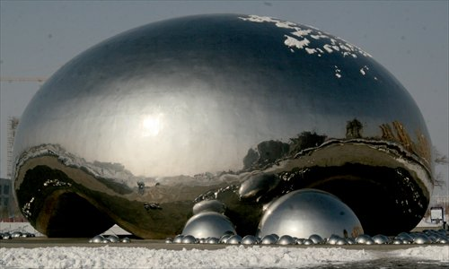
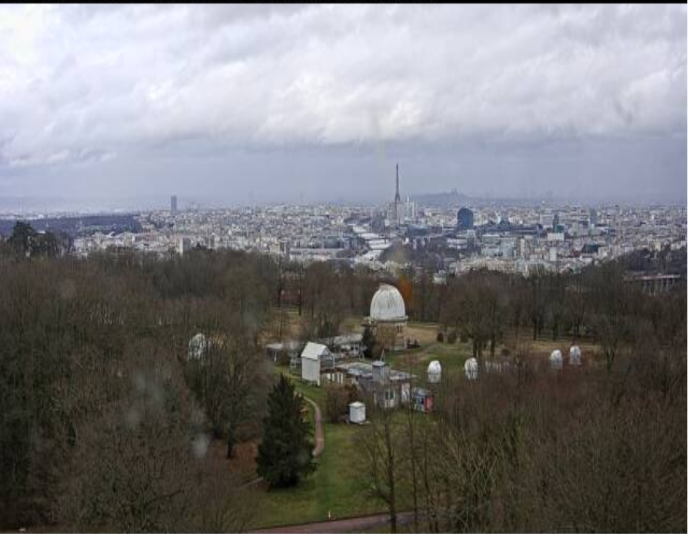
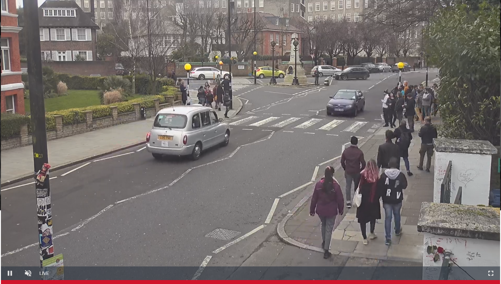

[Write-Ups](../README.md) > [TryHackMe](README.md) > [Geolocating Images](#geolocating-images)
___

# Geolocating Images
Write-Up to understand the Room to understand how to geolocate images.

**Links**
- [Challenge "Geolocating Images"](https://tryhackme.com/room/geolocatingimages)
- [TryHackMe](https://tryhackme.com)

**License**\
[CC-BY-SA](../LICENSE.md) - SqueakyFlamingo

## Contents
- [Geolocating Images](#geolocating-images)
  - [Contents](#contents)
    - [[Task 1] Getting Started](#task-1-getting-started)
    - [[Task 2] Getting our feet wet - where is this?](#task-2-getting-our-feet-wet---where-is-this)
    - [[Task 3] Geolocationg Images 101](#task-3-geolocationg-images-101)
    - [[Task 4] Now your turn](#task-4-now-your-turn)
    - [[Task 5] Helpful tips for geolocating](#task-5-helpful-tips-for-geolocating)
    - [[Task 6] Your turn, again!](#task-6-your-turn-again)
    - [[Task 7] Your turn, what can you see?](#task-7-your-turn-what-can-you-see)
    - [[Task 8] You're done!](#task-8-youre-done)

### [Task 1] Getting Started
**Simple.** Just read and download the ZIP. Then continue.

### [Task 2] Getting our feet wet - where is this?
\
Image 1

Try some reverse image searching with [Google](https://www.google.de/imghp) and [Yandex](https://yandex.com/images/search).

With Google you will find something, but it isn't helpful. For me a bunch of liquid balls showed up.

Yandex on the other hand finds the object perfectly. Just like the text from Task 1 told us. You will find the answer to the task on the caption of one of the search results.

    

        <b>Answer</b> (click to expand)
    

    

        china
    

### [Task 3] Geolocationg Images 101
Read the text. **Think** about the steps. And continue.

### [Task 4] Now your turn
\
Image 2

**What can you see?**\
There are two street signs.
* North Sheffield Avenue
* West Addison Street
  
*How about hacking them into google?*

You will quickly find a place in Chicago, USA. Now use maps to locate the images subject and then turn around 180 degrees and find the answer.

    

        <b>Answer</b> (click to expand)
    

    

        wrigleyville sports
    

### [Task 5] Helpful tips for geolocating
Read the text **carefully**. You may need some of the suggestions for your quest. Then continue.

### [Task 6] Your turn, again!
\
Image 3

To find the broader area direct your attention onto the two large landmarks in the background.
* a river and
* a tower of some sort

The tower looks a bit like the Eiffel tower in Paris and therefore the river may be the Seine.

Now open a map of your choice and try to locate the images view in *Meudon forest* south-west of Paris.\
On Gogle maps you will find, as a marked point of interest, the *Paris Observatory*.\
Find it on Wikipedia and find out which facility is shown in the current image, combine it with what you already know and you have the answer.

    

        <b>Answer</b> (click to expand)
    

    

        meudon observatory
    

### [Task 7] Your turn, what can you see?
\
Image 4

Remember the text from Task 5?\
Use your knowledge to find the following key points:
* main focus is a road
* left hand driving
* livestream of some sort

From the driving part try to think about a country for to match it. (e.g. Great Britain)\
Combine the bits of intel into a search term for Google and find the answer as one of the top results.

    

        <b>Answer</b> (click to expand)
    

    

        abbey road
    

### [Task 8] You're done!
Check out the listed links!

**And feel a sense of accomplishment.**\
Thanks for reading!
